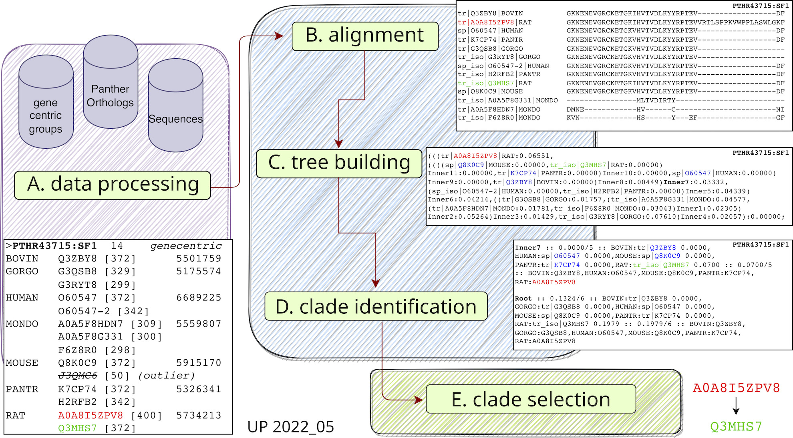

# ortho2tree

The [UniProt](https://www.uniprot.org) [Reference Proteomes dataset](https://www.uniprot.org/help/reference_proteome) seeks to provide complete proteomes for an evolutionarily diverse, less redundant, set of organisms. 

As higher eukaryotes often encode multiple isoforms of a protein from a single gene, the Reference Proteome pipeline selects a single representative (‘canonical’) sequence. UniProt identifies canonical isoforms using a ‘[Gene-Centric](https://www.uniprot.org/help/gene_centric_isoform_mapping)’ approach: proteins are grouped by gene-identifier and for each gene a single protein sequence is chosen. 

For unreviewed (UniProtKB/TrEMBL) protein sequences (and for some reviewed sequences), the longest sequence in the Gene-Centric group is usually chosen as canonical. This can create inconsistencies, selecting canonical sequences with dramatically different lengths for orthologous genes.

The Ortho2tree data pipeline examines Gene-Centric canonical and isoform sequences from sets of orthologous proteins (from [PantherDB](https://www.pantherdb.org/)), builds multiple alignments, constructs gap-distance trees, and identifies low-cost clades of isoforms with similar lengths. Canonical choices can be either confirmed or a better one proposed.

The pipeline and the underlying analysis is described in the manuscript *"Improved selection of canonical proteins for reference proteomes"*, whose pre-print is [available at BioRxiv](https://doi.org/10.1101/2024.03.04.583387).

An overview of the pipeline is shown in this figure:


The pipeline can retrieve protein sequences using direct access to the [UniProt](https://www.uniprot.org) databases or using the [UniProt web API](https://www.ebi.ac.uk/proteins/api/doc/).

Data processing is done via [pandas](https://pandas.pydata.org/) DataFrames employing vectorized operations and all the orthogroups can be processed in parallel if multithread is available.
For each orthogroup the pipeline:
- builds a Multiple Sequence Alignment (via [muscle](https://drive5.com/muscle/))
- calculates a gap-based Neighbour-Joining tree (via [BioPython](https://biopython.org/) using a modified pairwise distance function focused on gaps)
- scans the tree to identify low-cost clades
- ranks the best low-cost clades to confirm existing canonicals or suggest replacements

# Contents of the repository
```
ortho2tree.py    # main script to use to run the pipeline on the command line
ortho2tree.ipynb # jupyter notebook to run the pipeline interactively
ortho2tree/      # modules folder
requirements.txt # list of needed packages
README.md        # this text
MS_figures_src/  # all of the datafiles and .R code to recreate the figures in the manuscript
test/            # folder containing data ready for a quick test run
test.cfg         # configuration file for the quick test run
qfomam.cfg       # configuration file for the qfomam2022_05 analysis described in the manuscript
```

## INSTALLATION
- git clone the repository: 

```git clone https://github.com/g-insana/ortho2tree.git``` 

- install requirements (virtual environment is optional but recommended) via pip or conda/mamba:

via pip:
```
cd ortho2tree && python3 -m venv venv_o2t
source venv_o2t/bin/activate
pip3 install -r requirements.txt
```
via conda or mamba:
```
cd ortho2tree && mamba create --name ortho2tree --file requirements.txt --channel conda-forge
mamba activate ortho2tree
```

**Note** that you also need to install `muscle` for multiple sequence alignments, either version [v3.8.31](https://drive5.com/muscle/downloads_v3.htm) or the new [v5.1](https://github.com/rcedgar/muscle/releases/tag/5.1.0). Please check ortho2tree/config_muscle.py and update accordingly to your installation so that the muscle executable can be found and the correct format is set (according to the muscle version used).

e.g. via conda or mamba for 3.8.31:
```
#EITHER:
mamba install -c bioconda "muscle<=4.0" #3.8.31
#OR:
mamba install -c bioconda 'muscle>=5.0' #5.1
```

## QUICK TEST TO CHECK INSTALLATION
- test run of a single group

```./ortho2tree.py -set test -id PTHR43715:SF1```

- example of full analysis run of a set

```./ortho2tree.py -set test -no_stats```

## COMMAND LINE USAGE
```
usage: ortho2tree.py [-h] -set DATASET_NAME [-d] [-nocache] [-no_stats]
                     [-id SINGLE_GROUP [SINGLE_GROUP ...]] [-file LIST_FILENAME]
                     [-sugg SUGG_FILE] [-prevgc PREVGC_FILE] [-outstamp OUTSTAMP]

optional arguments:
  -h, --help            show this help message and exit
  -set DATASET_NAME     set for the analysis. a file SET.cfg should be present
  -d                    print verbose/debug messages
  -nocache              do not use cache, re-create alignments/trees and do not save them
  -no_stats             do not print any stats on the dataframe
  -id SINGLE_GROUP [SINGLE_GROUP ...]
                        to only work on one or few group(s)
  -file LIST_FILENAME   to work on a series of groups, from a file
  -sugg SUGG_FILE       to simulate integration of canonical suggestions reading a previosly
                        generated changes file; note that file should be placed in the set main dir
  -prevgc PREVGC_FILE   to integrate previosly generated changes file; note that file should be placed
                        in the set main dir
  -outstamp OUTSTAMP    to name and timestamp the output files and the dumps; this overrides the
                        outstamp parameter from the config

    Examples:
       -set=qfomam                                 #will do the analysis on the whole set
       -set=qfomam -id=PTHR19918:SF1               #only for one orthogroup
       -set=qfomam -id=PTHR19918:SF1 PTHR40139:SF1 #only for two orthogroups
       -set=qfomam -file=list_of_ids.txt           #for a series of groups listed in a file
```

## CONFIGURATION

Please check the the example YAML configuration files provided for the list of the parameters. E.g. 
[test yaml configuration file](test.cfg)

## DOCUMENTATION

Please refer to the [DOCS.md](DOCS.md) file for information on how to setup a new analysis and how to interpret the output produced.

## Analysis of UP2022_05 QfO mammals
The manuscript *"Improved selection of canonical proteins for reference proteomes"* ([preprint](https://doi.org/10.1101/2024.03.04.583387)) describes the `ortho2tree` analysis of eight QfO ([Quest for Orthologs](https://questfororthologs.org/)) mammalian proteomes, based on [UniProtKB](https://www.uniprot.org/) data (release UP2022_05).

See the folder [MS_figures_src](MS_figures_src) for datafiles and .R code to recreate the figures in the manuscript

To replicate the analysis from the paper:
```
wget -O qfomam.tar.gz https://zenodo.org/records/10778115/files/qfomam.tar.gz?download=1  #retrieve the archive
tar xfz qfomam.tgz                                               #uncompress the archive
./ortho2tree.py -set qfomam -id PTRH43715:SF1                    #run a single orthogroup
./ortho2tree.py -set qfomam -outstamp $(date +%y%m%d)            #do the analysis
```
The [Zenodo](https://doi.org/10.5281/zenodo.10778115) archive [qfomam.tgz](https://zenodo.org/records/10778115/files/qfomam.tar.gz?download=1) contains pre-computed alignments, trees and clades
(or alternatively from [Figshare](https://figshare.com/ndownloader/files/44836240)).

A web interface for filtering and viewing the pdf files (with trees and alignments for each orthogroup) from the result of that analysis (and subsequent ones) is available at [fasta.bioch.virginia.edu/ortho2tree](https://fasta.bioch.virginia.edu/ortho2tree)

The pdf files, generated whenever canonicals were confirmed or changes were proposed, are available as a Zenodo archive: [qfomam_pdf_data.tgz](https://zenodo.org/records/10778115/files/qfomam_pdf_data.tar.gz?download=1) (or alternatively from [Figshare](https://figshare.com/ndownloader/files/44836390)).

A script to generate the pdf files is included under the folder [pdfcreation/](pdfcreation/)

## LINKS

- [Zenodo resource](https://zenodo.org/records/10778115)
- [FigShare project](https://figshare.com/projects/ortho2tree/197614)
- [BioRxiv preprint](https://doi.org/10.1101/2024.03.04.583387)
